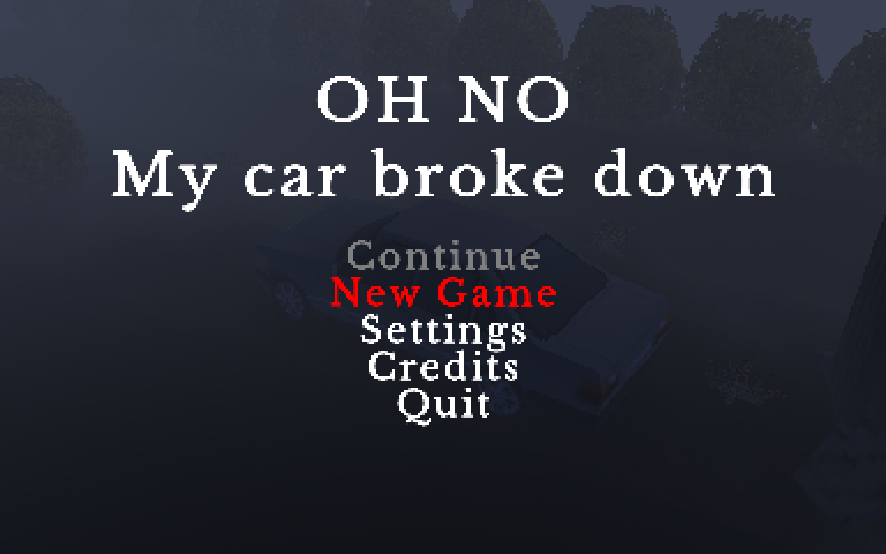
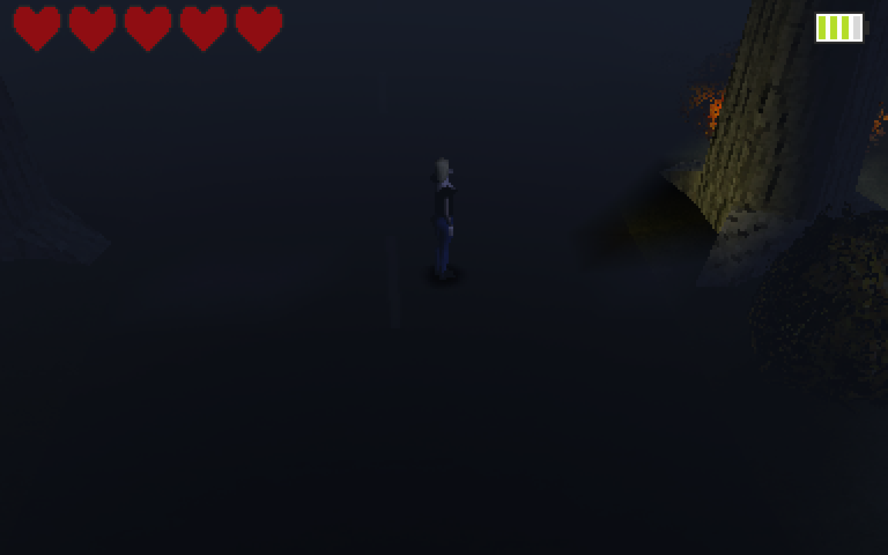
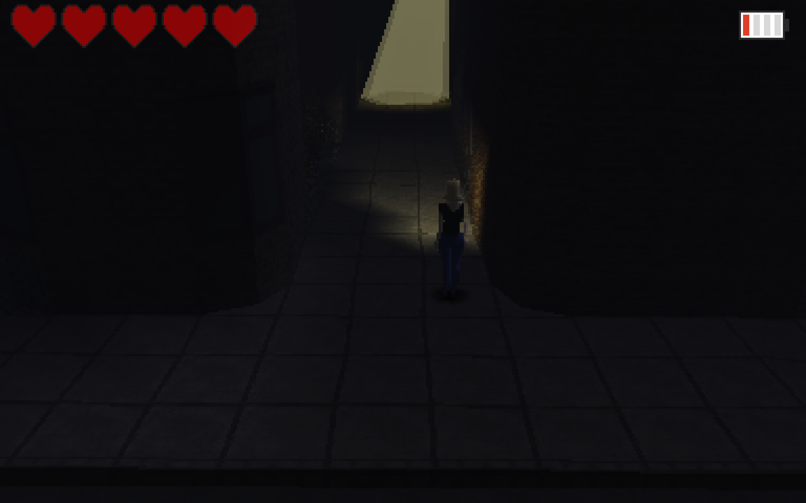
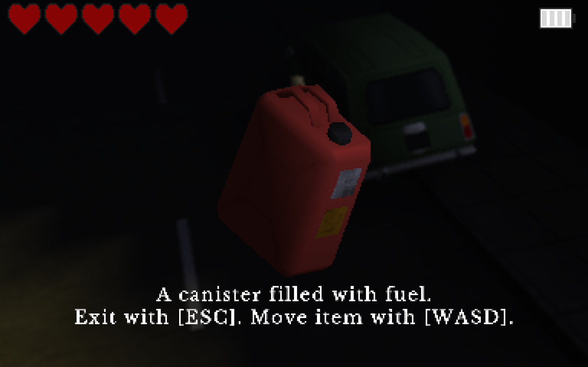

# The Game

Your car broke down in the middle of nowhere.
You will have to find the necessary tools and equipment to get it running again.
Will you manage to survive this dark autumn night?

# Why

OH NO My car broke down is a game/demo originally developed as part of a university game programming course.
The game is developed in Unity as this was one of the requirements (I actually hate Unity quite passionately).
It was meant to be a horror game in the style of Silent Hill or Resident Evil, but it is not that scary actually.
Nevertheless, the game was quite well received, and some students were wondering how we managed to create the playstation like visuals.
To help new game developers on their journey, this is now an open source project.

Do not expect me to fix all the bugs and issues, but I will try my best.
Also note that the code and the overall software infrastructure is quite messy.

# LICENSE

Please refer to the file named "LICENSE_AND_COPYRIGHT_NOTICE.txt" and the respective license files called "BSD3C.txt" and "CCBY4.txt".
A list of third party asset creators is provided in the "third_party_sources.txt" file.

# Some nice screenshots

## Main Manu

## Ominous Street

## The Village

## Inspecting an item

